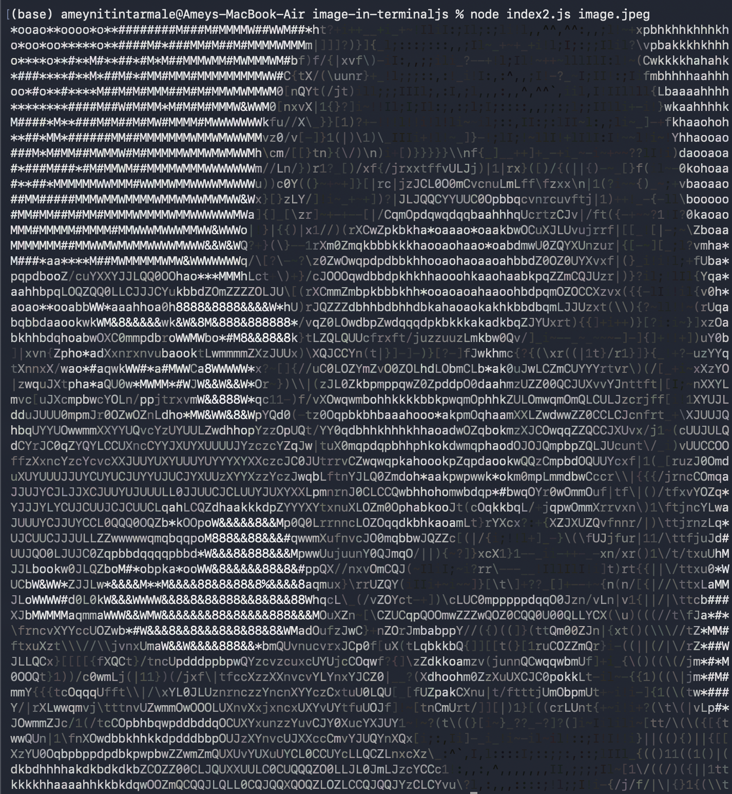

# Image in Terminal.js

Transform any image into stunning terminal art using different rendering techniques. Each pixel's brightness and colors are intelligently preserved and rendered directly in your terminal using ANSI colors and various character sets.

## Screenshots

### Original Image


### Terminal Output (ASCII Art)


## Features

- **Multi-format Image Support** - Loads PNG, JPEG, BMP, GIF and other image formats using Jimp
- **Intelligent Image Resizing** - Automatically maintains aspect ratio while compressing to your desired width
- **Full Color Preservation** - Uses 24-bit ANSI colors to recreate the original image's vibrant hues
- **Terminal Native** - No GUI required, runs entirely in your terminal with pure text output
- **Customizable Output Width** - Adjust width to fit any terminal size (80, 100, 120, 150+ characters)
- **Multiple Rendering Methods** - Choose from ASCII art, braille patterns, or half-block rendering

## Installation

1. Install Node.js (v14 or later)
2. Clone this repository
3. Install dependencies:
```bash
npm install
```

## Usage

### Rendering Methods

**index2.js - ASCII Art (Recommended)**
ASCII characters mapped to pixel brightness with full color support.
```bash
node index2.js image.jpg
node index2.js image.jpg --width 120
node index2.js photo.png -w 80
```

**index3.js - Braille Characters**
Uses Unicode braille patterns for finer detail and higher pixel density.
```bash
node index3.js image.jpg
node index3.js image.jpg --width 100
```

**index1.js - Half-Block Rendering**
Uses half-block characters (▄) with background and foreground colors for direct pixel-level control.
```bash
node index1.js image.jpg
node index1.js image.jpg --width 100
```

### Options

- `--width` or `-w`: Set output width in characters (default varies by method)
- Image path: Path to your image file

### Examples

```bash
# Try different rendering methods on the same image
node index2.js photo.png -w 100    # ASCII art
node index3.js photo.png -w 100    # Braille
node index1.js photo.png -w 100    # Half-blocks

# Adjust for your terminal width
node index2.js landscape.jpg -w 80  # Narrow terminal
node index2.js landscape.jpg -w 150 # Wide terminal
```

## Rendering Methods Explained

### index2.js - ASCII Art
Maps pixel brightness to ASCII characters (` ` to `@`) with full RGB color for each character. Best for artistic effect and color accuracy.
- Gradient: ` .'` ,:;Il!i~+_-?][}{1)(|/tfjrxnuvczXYUJCLQ0OZmwqpdbkhao*#MW&8%B@$`
- Resolution: Depends on width setting
- Color Support: Full 24-bit ANSI colors

### index3.js - Braille Characters
Uses Unicode braille patterns (⠀ ⠁ ⠂ ... ⠿) for higher pixel density. Each braille character represents a 2×4 pixel grid.
- Resolution: Double horizontal, double vertical compared to ASCII
- Color Support: Limited (black and white)
- Best for: High-detail monochrome rendering

### index1.js - Half-Block Rendering
Uses Unicode half-block character (▄) with separate background and foreground colors. Shows two pixels per character (stacked vertically).
- Resolution: One character = 2 vertical pixels
- Color Support: Full 24-bit ANSI colors
- Best for: Smooth color gradients and subtle details

## Files

- `index2.js` - ASCII art rendering (recommended)
- `index3.js` - Braille character rendering
- `index1.js` - Half-block rendering
- `image.jpeg` - Sample image for testing
- `output.png` - Example terminal output
- `package.json` - Project configuration

## Requirements

- Terminal with 24-bit ANSI color support (iTerm2, Kitty, Windows Terminal, VS Code terminal)
- Node.js v14 or later

## Troubleshooting

**Colors not showing?**
- Your terminal may not support 24-bit color. Try using iTerm2, Kitty, Alacritty, or Windows Terminal.

**Image not found?**
- Verify the file path is correct: `node index2.js ./path/to/image.jpg`

**Module error?**
- Run `npm install` to install Jimp dependency

**Output looks stretched or squished?**
- Adjust the width parameter: `node index2.js image.jpg -w 100` or try a different width

**Braille characters not rendering?**
- Your terminal may not support Unicode braille. Try a different rendering method.

## Customization

### ASCII Art (index2.js)

**Change character gradient**:
```javascript
const GRADIENT =
    " .'`^,:;Il!i~+_-?][}{1)(|\\/tfjrxnuvczXYUJCLQ0OZmwqpdbkhao*#MW&8%B@$";
```

**Change default width**:
```javascript
const options = { image: null, width: 120 };  // Change 120 to your preferred default
```

## Dependencies

- **Jimp** - Pure JavaScript image manipulation library

## Comparison

| Feature | ASCII | Braille | Half-Block |
|---------|-------|---------|-----------|
| Color Support | ✅ Full 24-bit | ❌ B&W | ✅ Full 24-bit |
| Resolution | Medium | High | Medium |
| Character Density | 1 char/pixel | 4 pixels/char | 2 vertical pixels/char |
| Artistic Effect | High | Low | High |
| Recommended For | Photos, art | Fine details | Smooth gradients |
